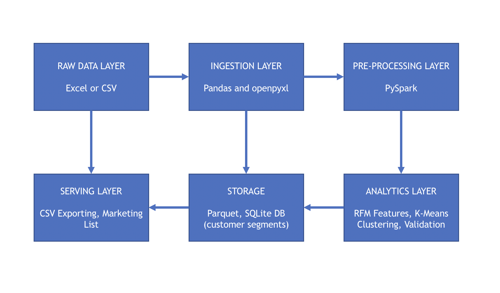

# Online Retail Big Data Project

### 1.1 Business Objective
Identify high-value customers for targeted retention marketing to maximize revenue from the company's most profitable customer segments, addressing the challenge of limited marketing budget in a resource-constrained e-commerce environment.

### 1.2 Analytical Question
"Which customers exhibit high-value purchasing behavior (defined by RFM metrics: Recency, Frequency, Monetary value) and can be grouped into distinct segments for prioritized marketing campaigns, using only transactional data from Invoice, Customer ID, InvoiceDate, Quantity, and Price columns?"

### 1.3 Expected Outcomes
#### Deliverables
- Customer segmentation report with 3-5 RFM-based clusters (High-Value, Loyal, At-Risk, Lost, Price-Sensitive)
- Top 20% high-value customer list with actionable contact data (CustomerID, Country)
- Segment performance metrics (average revenue per segment, retention rate, purchase frequency)

#### Success Metrics
- Silhouette Score > 0.5 for cluster quality
- 80/20 Pareto validation: Top 20% customers generate ≥80% revenue
- Business ROI proxy: High-value segment shows 3x higher lifetime value vs average

#### Stakeholder
Marketing Manager who receives a prioritized customer list for email/SMS retention campaigns, enabling 20% budget allocation to customers generating 80% revenue.

#### Practical Use
Marketing team imports the "High-Value Customer List" CSV into their CRM/email platform to execute personalized discount campaigns, expecting 15-25% uplift in repeat purchase rate within 90 days.

## TASK 2: BIG DATA ARCHITECTURE DESIGN 

### 2.1 Architecture Diagram

### 2.2 Layer Architecture Description and Justification
The complete architecture is batch, on-premise, and depends on open-source tooling.
#### Raw Data Layer
Tools: Excel (.xlsx), CSV files on local disk
Role: Stores transactional data (Invoice, Customer ID, Quantity, Price, InvoiceDate, Country)
Justification: Matches dataset description and operational constraint. Additionally, no cloud storage is needed.

### Ingestion Layer
Tools: pandas.read_excel() + openpyxl, spark.createDataFrame()
Role: Converts Excel/CSV → PySpark DataFrame with schema inference and basic validation
Justification: Proven working in the local environment.

### Pre-Processin Layer
Tools: PySpark (SparkSession), Jupyter Notebook, Python
Role: Executes RFM calculations (Recency=days since last purchase, Frequency=invoice count, Monetary=total spend), data cleaning (null CustomerID removal), feature scaling
Justification: Single-node PySpark handles 500K+ transaction rows on-device. 

### Storage Layer
Tools: Parquet files, SQLite
Role: Persists raw data, RFM features, and final customer segments for later audit/re-run, or analysis further down the line.
Justification: Parquet files feature better compression compared to CSV, while SQLite offers lightweight relational store for segment lookup.

### Analytics Layer
Tools: PySpark MLlib (StandardScaler, KMeans), groupBy().count()
Role: K-means clustering on RFM features, silhouette score validation, segment profiling
Justification: MLlib included in PySpark—no extra installs. Scales to full dataset while running locally.

### Serving Layer
Tools: CSV export, Excel export for marketing team
Role: Delivers "High-Value Customer List" and segment report to Marketing Manager
Justification: CSV/Excel universally compatible with CRM tools, with no cloud dependency.

### Conclusion
The pipeline is achieved 100% locally on-device, with all components running on a singl MacBook Pro. No intenet connection, cloud resources, and no local servers are required. All of the tooling used is open-source and requires zero extra funds or budget. One Jupyter notebook orchestrates everything.

